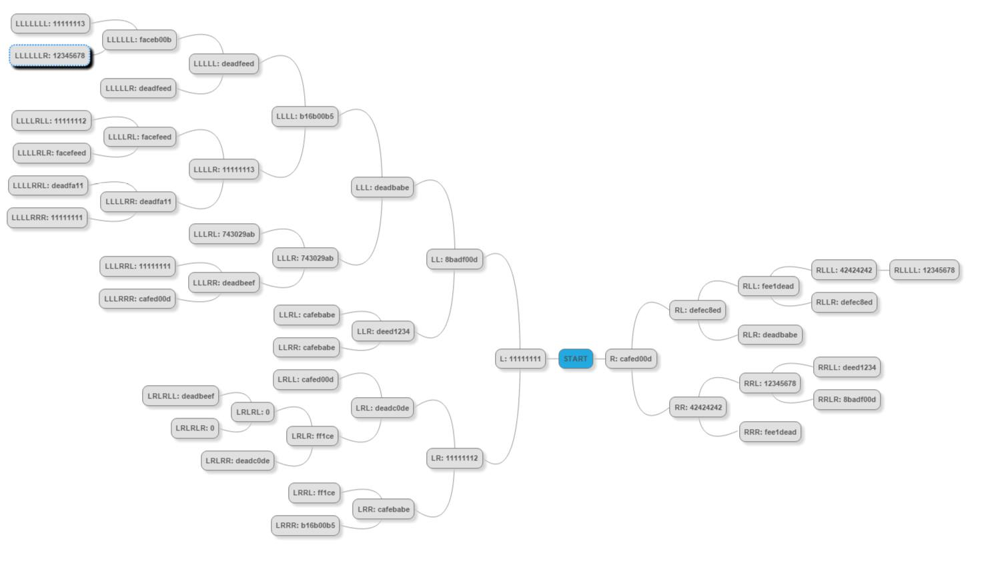

# 400 Graphic

> Your parents told you to never wander in Middle Earth by yourself.
> nc 54.152.31.35 1337
> graphic_4a241880e4f2a244ee97913d946cbf943fc18d5a.zip

Upon unzipping the file, you get a single binary. After using retdec to decompile to C, inspecting the decompiled code finds several variables of a struct_0 pointer type. The struct struct_0 was defined as follows:

```c
struct struct_0 {
    int32_t * e0;
    int32_t e1;
    int32_t * e2;
};
```

LxRLLxRRLxLxRLxRRxLxLxLxLxLL




## Flag

flag{th3r3_and_b4ck_again}
