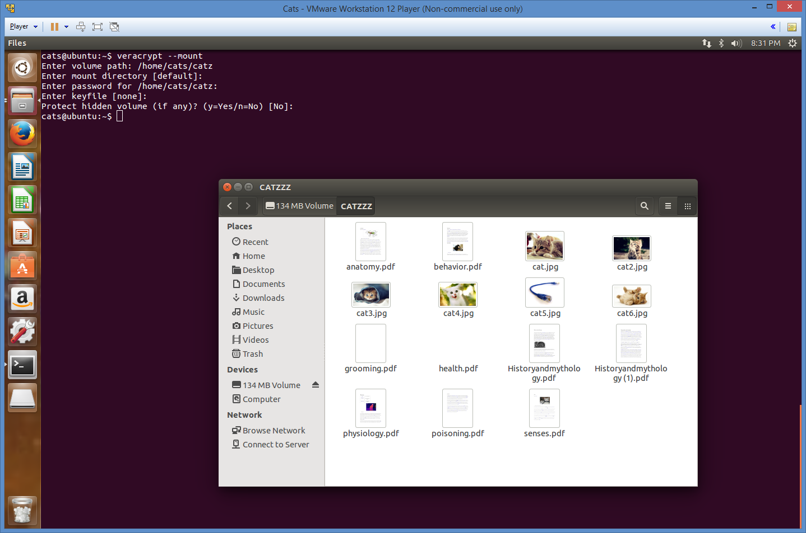

# 450 Cats

Writeup by The Deductive Failures

> I had fun once, it was horrible.

> Password: F3lyn34LifE!

> cats_51474229fe0d9bbd8da500fe3f74b383d175cee1.zip

Aside from taking forever to download, this problem actually wasn't too bad.

Inside the user's home directory, there seems to be a random `catz` file, keylogger program, and a `veracrypt` installer. `file`ing the catz file didn't help; it just said it was "data". We can confirm that both `logkeys` and `veracrypt` have already been installed on the system.


Since we don't know anything about `veracrypt`, let's first run `logkeys`. Running it produced a list of options we could use. Immediately I noticed that there was a default output file.


Sure enough, there was a `logkeys.log` file inside `/var/log`. So it seems that whoever used this VM before must have already gotten keylogged. We can use the log to figure out what the person who used this VM did to create the `catz` file. Let's take a look at the log file.

```
sudo apt-get install build-essential
wget https://logkeys.googlecode.com/files/logkeys-.01.1a.tar.gz
wget https://logkeys.googlecode.com/files/logkeys-0.1.1a.tar.gz
tar xvzf logkeys-0.1.1a.tar.gz
cd logkeys-0.1.1a/
./configure
make
sudo make install
sudo locale-gen
sudo logkeys -s
sudo gedit ~/.bash_history
cler
clear
veracrypt -t -c
1
/home/cats/catz
128 M
1
2
2
Me0wL3tMeInPl$
Me0wL3tMeInPl$
vyiivyiviparapvraivpyvyrivfyipefiyewyfwvpfiyewvfhnfzslc hvbhawbvklvhbsizbc awhbvua vawenvlfjvba;i vaw;vil;Vbhifvbahvbairk  iwbf irfirryarlhbvlhb ldbdkbvldv hbvhliebalkjverssnsnsr fefj g;ergp; gresgnlsbknbktjsnbkjtnkbjntsjrknblksnljsnb;ojrne orgse;go;egut;siggtibsi lknageosr;gnkjfd,n;ajrngout;fgnbseijrb f,nbs;efvmb gser
```

I'm still kinda confused how the keylogger was able to log anything before `sudo logkeys -s`. Weird.

So it seems that `catz` is a volume of files created by `veracrypt`. The password is `Me0wL3tMeInPl$`, and there seems to be no keyfile used. Since we already have `veracrypt` installed, we can just use that to mount the volume.

```
cats@ubuntu:~$ veracrypt --mount catz
Enter mount directory [default]:
Enter password for /home/cats/catz:
Enter keyfile [none]:
Protect hidden volume (if any)? (y=Yes/n=No) [No]:
Enter your user password or administrator password:
```



A bunch of PDFs and images. Let's try the PDFs first. I did a quick Google search on `extract resources from pdf linux`, and found that Ubuntu has tools preinstalled for extracting things out of PDFs :D.

So there's `pdfimages` and `pdftotext`, but `pdftohtml` should be able to do it all. We `pdftohtml` all the files, and then grep for "flag" and sure enough, the flag was there!

## Flag

`{DX5wMM0pCiNwtxf5bEhNscgIFQOWHjNECrp2NYBR}`